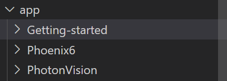

# FRC Guides
A site with guides for the First Robotics Competition

# How this site works
1. In src/app, each folder is a route. Using generateRoutes.js or the build.exe, you can automatically generate html pages.
2. The script checks every route and generates HTML from the main.md file in each route.
3. The navbar and sidebar in the site is generated using the name of each route/folder by removing all occurances of '-' and replacing it with a space
4. If you want to create a dropdown, you have to go to app/config and add the dropdown in this format:
> Example:
```
~The dropdown button text that appears in the navbar
This should correspond to a route/folder
Another route/folder
```
> It would be easier if you saw a working example, here is the example 
folder structure:



> And here is the config.txt:

```
~Guides on third party libraries
Phoenix6
PhotonVision
```

> That means that the files below the ~ must be exactly typed as the folder name. However, the text after ~ can be anything since it's the button text

5. Either use ```./build``` (instructions on how to generate a exe are below) or run ```bun run routes``` to build the routes (./build is a compiled version of the file that is run using bun run routes so it's much faster)

6. Finally, run ```bun run dev```

# Build the route generator for faster route generation
```bun build --compile --minify --sourcemap ./path/to/routeGenerator --outfile build``` (as described in https://bun.sh/docs/bundler/executables)

# Future ideas
- Add way to auto generate a table of contents for each main.md (based on the h2 tags)